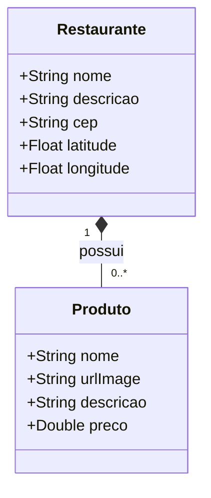

# desafio-stefanini - Mini IFood

 

## Documentação:

Diagrama de entidades:

+ Diagrama restaurantes e Produtos:

O tema da aplicação é livre — use sua criatividade! 

Critérios técnicos:
+ Tecnologia obrigatória: a aplicação deve ser desenvolvida utilizando Spring Boot.
+ Crie um desenho da solução (diagrama ou documentação breve) explicando a arquitetura da sua aplicação.
+ A aplicação deve permitir a consulta de CEPs utilizando uma API externa (preferencialmente utilize Wiremock, Mockoon ou solução similar para simular essa API).
+ Todas as consultas realizadas devem ser logadas em uma base de dados, contendo o horário da requisição e os dados retornados da API externa.
+ A solução deve aplicar os princípios básicos do SOLID.
+ O código deve ser disponibilizado em um repositório público no GitHub.
+ A entrega deve ser feita até 12/10 às 09h00, com o envio do link do repositório.
+ Tecnologias obrigatórias
+ Java 11 ou superior
+ Spring Boot
+ Banco de dados (relacional ou não-relacional)

Será considerado um diferencial
+ Utilização de Docker para subir a base de dados e os mocks
+ Uso de serviços na AWS
+ Apresentação do desafio
+ Após o envio do projeto, agendaremos uma entrevista para que você possa apresentar sua solução. A apresentação deve seguir os seguintes pontos e terá duração máxima de 15 minutos:
+ Explicação do desenho da solução
+ Demonstração do código-fonte
+ Inicialização da aplicação
+ Execução de uma ou mais operações no sistema
