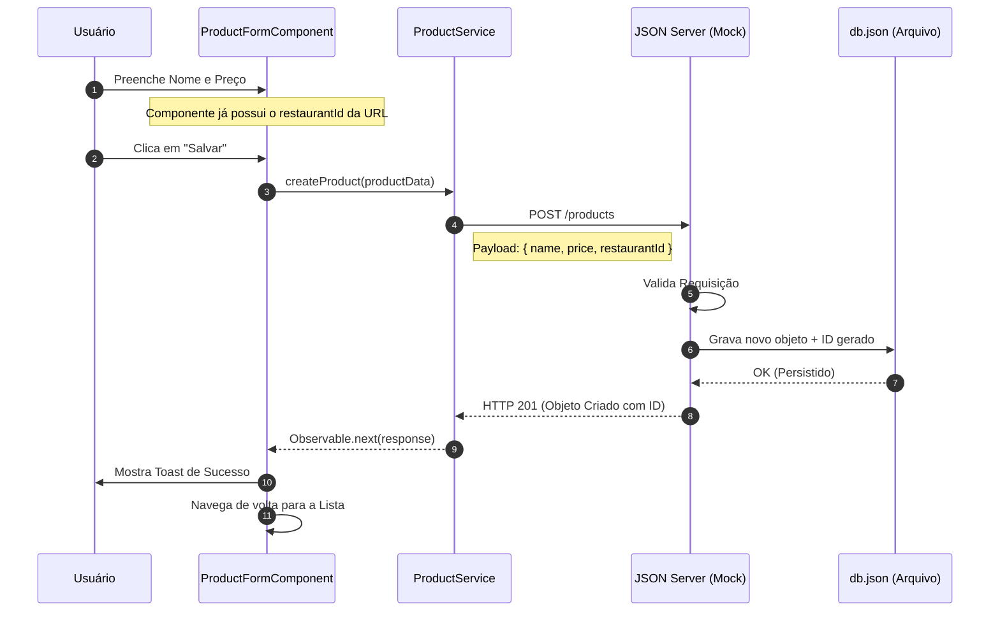
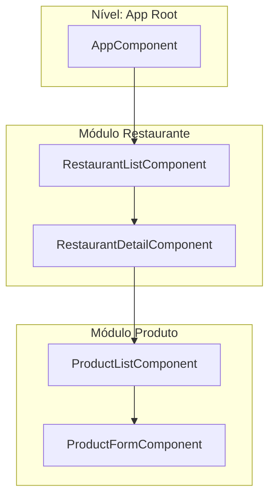

# Frontend

Jornada:

```mermaid
sequenceDiagram
  autonumber
  participant U as Usuário
  participant C as ProductFormComponent
  participant S as ProductService
  participant M as JSON Server (Mock)
  participant D as db.json (Arquivo)

  U->>C: Preenche Nome e Preço
  Note over C: Componente já possui o restaurantId da URL
  U->>C: Clica em "Salvar"

  C->>S: createProduct(productData)

  S->>M: POST /products
  Note right of S: Payload: { name, price, restaurantId }

  M->>M: Valida Requisição
  M->>D: Grava novo objeto + ID gerado
  D-->>M: OK (Persistido)

  M-->>S: HTTP 201 (Objeto Criado com ID)
  S-->>C: Observable.next(response)

  C->>U: Mostra Toast de Sucesso
  C->>C: Navega de volta para a Lista
```

arquitetura:

```mermaid
graph TD
    subgraph "Nível: App Root"
    App[AppComponent]
    end

    subgraph "Módulo Restaurante"
    List[RestaurantListComponent]
    Detail[RestaurantDetailComponent]
    end

    subgraph "Módulo Produto"
    PList[ProductListComponent]
    PForm[ProductFormComponent]
    end

    App --> List
    List --> Detail
    Detail --> PList
    PList --> PForm
```
